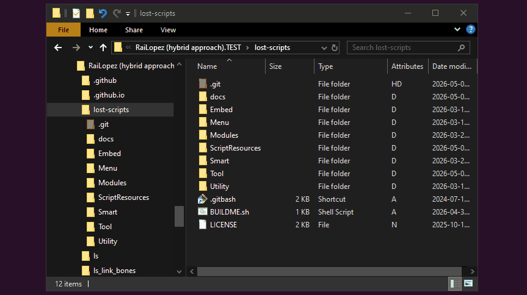

<h1 align="center">Development</h1><br>

## 🗺️ Overview

Guide and best practices for developing Lost Scripts for [MOHO][1]<sup>®</sup> Animation Software. Unlike traditional workflows where each script is developed in isolation, the [Lost Scripts][2]™  project uses a **Unified Monorepo Strategy** along with a few house rules. Beyond that, standard Moho [Scripting Conventions][3] apply.

- **The Monorepo (<kbd>lost-scripts</kbd>):** The master repository, **workshop and source of truth**. It mirrors Moho Pro's directory structure, allowing Scripts, Modules, Utils, and Docs to coexist interconnected. Since its name matches the username, it becomes a ✨*special*✨ repository whose README (the one with the Catalog) appears directly in the organization's [GitHub profile][4].

- **The Script Packs (e.g., <kbd>ls_shapes</kbd>):** Independent repositories that act as "History Arks" and "Distribution Containers". They are **not for development**; they are finalized versions automatically populated by the Builder. The primary rule is simple: the presence of the [`ScriptDeps`](#3-creating-a-new-script "See point 3.2 et seq...") variable determines what becomes a standalone pack versus a shared resource.

---

### 1\. 🗂️ Project Structure/Architecture

The Lost Scripts™ project is organized around a unified local workspace (e.g., a folder named *LS*). This workspace acts as the root for the aforementioned *Monorepo*, *Script Packs*, and administrative tools, and it's based on the following folder structure and file logic:

<dl><dd><details open>
<summary><mark><strong>&nbsp;D:/Rai/Projects/LS/</strong> (Expand/Collapse)&nbsp;</mark></summary><br>

```bash
📂LS # THE WORKSPACE
├───📄LS.code-workspace # VS Code multi-root project configuration
│
├───📂.github # Community health files & administrative tools
│       📄DEVELOPMENT.md # 📍 Development & contribution guide
│       📄ENVIRONMENT... # Global environment & workflow specs
│
├───📂.github.io # Optional project's static site repository (<user>.github.io on GitHub)
│       ├───📁.git
│       └───📁content/scripts
│           ├───📁ls # Core static webpage container
│           │       📄index.md # Core auto-generated Markdown file
│           │
│           ├───📁ls_shapes # Script static webpage container
│           │       📄index.md # Script auto-generated Markdown file
│           │
│           └───📁ls_another_script...
│
├───📂lost-scripts # THE MONOREPO/WORKSHOP/FORGE
│   │   📄.config # Monorepo's base/official configuration file (see point 4)
│   │   📄.gitignore # Public (Use '.git/info/exclude' for local-only exclusions, e.g. for WIP stuff)
│   │   📄BUILDER.sh # THE BUILDER (Must always reside at the Monorepo root!)
│   │   📄LICENSE
│   │
│   ├───📂.git # Monorepo's tracking
│   │   ├───📁hooks
│   │   └───📂info
│   │           📄exclude...
│   │
│   ├───📂docs # README files, etc.
│   │   │   📝.config # 🔒 Private sandbox override (Untracked; local-only)
│   │   │   📄.config.sample # Generic configuration template/ blueprint
│   │   │   📄README.md # Monorepo's README (📖 The catalog list container)
│   │   │
│   │   ├───📂assets
│   │   │       🖼icon.png
│   │   │       🖼logo...
│   │   │
│   │   ├───📂ls # Core documentation & stuff...
│   │   │   │   📄index.md # Core pack's working README (Hugo friendly) file
│   │   │   │
│   │   │   ├───📂.dist
│   │   │   │      📦ls.zip # Core pack's autogenerated ZIP archive
│   │   │   │
│   │   │   └───📂assets
│   │   │           🖼icon.png
│   │   │           🖼logo...
│   │   │
│   │   ├───📂ls_shapes # Pack documentation & stuff...
│   │   │   │   📄index.md # Pack's working README (Hugo friendly) file
│   │   │   │
│   │   │   ├───📂.dist
│   │   │   │       📦ls_shapes.zip # Pack's autogenerated ZIP archive
│   │   │   │
│   │   │   └───📂assets
│   │   │           🖼icon.png
│   │   │           🖼image_gallery...
│   │   │
│   │   └───📁ls_another_script... # Pack documentation & stuff...
│   │
│   ├───📂Menu # ...Modules, ScriptResources, Tool, Utility (Moho standard, and our WORKING, folders)
│   │   │   📄ls_separator.lua
│   │   │
│   │   └───📂- Lost Scripts
│   │           📄ls_shapes.lua
│   │           📄ls_webpage.lua
│   │
│   ├───📂Modules
│   │       📄ls_modules.lua
│   │
│   ├───📂ScriptResources
│   │   ├───📂ls
│   │   │   │   📄LICENSE
│   │   │   │   🖼ls_icon.png
│   │   │   │   🖼ls_icon_fallback...
│   │   │   │
│   │   │   └───📂Docs
│   │   │       │   📄WRITEME.md # Core README.md/index.md source file
│   │   │       │
│   │   │       └───📂assets
│   │   │               🖼ls_icon...
│   │   │
│   │   ├───📂ls_shapes
│   │   │   │   📄LICENSE
│   │   │   │   🖼ls_icon.png
│   │   │   │   🖼ls_info_button...
│   │   │   │
│   │   │   └───📂Docs
│   │   │       │   📄WRITEME.md # Pack README.md/index.md source file
│   │   │       │
│   │   │       └───📂assets
│   │   │               🖼ls_icon...
│   │   │
│   │   └───📁ls_another_script...
│   │
│   ├───📂Tool
│   │       📄_tool_list_ls.txt
│   │       📄ls_shapes.lua
│   │       🖼ls_shapes.png
│   │       🖼ls_shapes@2x.png
│   │       📄ls_another_script.lua
│   │       🖼ls_another_script.png
│   │       🖼ls_another_script@2x.png
│   │
│   └───📂Utility
│           📄ls_utilities.lua
│
├───📂ls # THE CORE PACK (⚠ Auto-populated Distribution)
│   │   📃READONLY! # ⚠ Read-only zone reminder
│   │   📄LICENSE
│   │
│   ├───📁.git # Builder-Untouchable (🛈 Packs with both a repo and a remote are the ones eligible for publishing!)
│   │
│   ├───📂docs
│   │   │   📄README.md # Core pack's Auto-generated README (⭐ The starred list container)
│   │   │
│   │   └───📂assets
│   │           🖼icon.png
│   │           🖼icon_fallback...
│   │
│   └───📁Menu...
│
├───📂ls_shapes # A SCRIPT PACK (⚠ Auto-populated Distribution)
│   │   📃READONLY! # ⚠ Read-only zone reminder
│   │   📄LICENSE
│   │
│   ├───📁.git # Builder-Untouchable (🛈 Packs with both a repo and a remote are the ones eligible for publishing!)
│   │
│   ├───📂docs
│   │   │   📄README.md # Pack's Auto-generated README
│   │   │
│   │   └───📂assets
│   │           🖼icon.png
│   │           🖼icon_fallback...
│   │
│   └───📁Menu...
│
└───📂ls_another_script # A SCRIPT PACK (⚠ Auto-populated... 🛈 No repo; ineligible for publishing!)
    │   📃READONLY! # ⚠ Read-only zone reminder
    │   📄LICENSE
    │
    └───📁docs...
```
</details></dd></dl>

---

### 2\. 💻 Environment Setup

The project requires *[Git Bash][5]* on Windows (or a standard Bash shell on Unix-like systems) [^1] and, recommendably, that the appropriate environment [^2] has been set up.

* **2.1\. Cloning:** Clone the *Monorepo* *[lost-scripts][6]* into your workspace folder (e.g., `LS/`).

* **2.2\. Permissions:** Ensure you have the necessary access to the *lost-scripts* organization. To manage multiple identities (e.g., personal vs. org) and avoid *403* errors, it's highly recommended to use **SSH Host Aliases** (see [ENVIRONMENT.md](./ENVIRONMENT.md#-ssh "Go to file's .ssh section...")):

	- **Identity Verification:** Run `ssh -T git@github.com` or (e.g., personal) `ssh -T git@github-railopez` to test the active identity.

	- **Remote Setup:** Repositories must be configured using the aliases defined in your `~/.ssh/config`:

		- **Organization Repos:** `git@github.com:lost-scripts/repo.git` (Main/Standard host format)
		- **Personal Repos:** `git@github-railopez:user/repo.git` (Custom host format)

	- **Remote Update:** If you cloned via HTTPS or used the wrong host, run: `git remote set-url origin <correct-url-format>`

	> ⚠ **Caution:** Never share or lose your private keys in `~/.ssh/`. If lost, you must generate new ones and update the public keys in your GitHub account settings (see [GitHub's SSH Guide][7]).

* **2.3\. Integration & Testing Grounds:** Moho® strictly requires its custom scripts to live inside a single directory named exactly `Scripts`. To test your development progress as usual by simply pressing <kbd>Alt+Shift+Ctrl+L</kbd>, the Builder offers two alternative environments tailored to your workflow:

	- **Selective Pack Symlinking** (Automated & Surgical): Ideal for coding specific tools while keeping your production environment intact. The Builder can automatically inject individual symlinks into Moho for the active packages you choose. To use this, set `BUILD_ASSIST["SYMLINKS"]=true` and list the pack IDs and shared files that you want to mirror inside the `BUILD_SYMLINKS` array (see configuration below).

	- **Full Environment Toggling** (Global Workspace Link): Ideal for deep core testing or isolating your entire monorepo. Instead of file-by-file linking, you can seamlessly switch Moho's entire script infrastructure between animating (production) and coding (development) taking advantage of the symlink the Builder provides (i.e., `ln -s ../LS/lost-scripts Scripts.OFF`) and using a multi-step* renaming strategy:

		| Target Mode     | *The Symlink* (Points to Monorepo) | The Real Directory In Your *CCF* |
		| :-------------- | :--------------------------------: | :------------------------------: |
		| **DEVELOPMENT** |             *Scripts*              |            Scripts.OFF           |
		| **PRODUCTION**  |           *Scripts.OFF*            |              Scripts             |

		*<sub>To avoid name collisions while dealing with namesake folders in Windows, always append a temporary extension first (e.g., rename `Scripts` to `Scripts.TMP`, adjust the target item, and finally restore the definitive names).</sub>

		> ⚠ **Warning**: Moho's *Scripts > Install Script...* wizard has a known recursive bug that truncates workspace files to 0KB if the `Custom Content/Scripts` directory itself is chosen as the source. Exercise extreme caution when dealing with it, or temporarily (re)move the symlink beforehand to safeguard the Monorepo from data loss.

---

### 3\. 🐣 Creating a New Script

* **3.1\.** As usual, add the <kbd>.lua</kbd> file(s) in the appropriate subfolder (Menu, Tool, etc.) and, if needed, a dedicated resource folder (e.g., `LS/lost-scripts/ScriptResources/ls_my_script/`).

	> 💡 **Tip:** Creating a dedicated documentation/source folder (e.g., `LS/lost-scripts/ScriptResources/ls_my_script/Docs`) is highly recommended anyway, not only to enable automated README maintenance and ZIP creation, but also to provide a single location where to keep all your script development-related resources organized.

* **3.2\.** The way the system identifies a script as a **pack** is by looking for the presence of the `ScriptDeps` variable at the top of its **main** Lua file(s). E.g., `LS/lost-scripts/Menu/ls_my_script.lua`:

	```lua
	-- **************************************************
	-- Provide Moho with the name+ of this script object
	-- **************************************************

	ScriptName = "LS_MyScript" -- Required by Moho®
	ScriptBirth = "19780811-0600"
	ScriptBuild = "20260526-1530"
	ScriptTarget = "14.4 Pro"
	ScriptStage = "BETA"
	ScriptDeps = {"Utility/ls_utilities.lua", "Modules/ls.lua"} -- 👈 THIS! (An empty table means no dependencies)
	ScriptDesc = "My new and awesome Moho script." -- Optional
	```

* **3.3\.** During the build process, if the Builder detects this variable, it **registers the script as a pack** (via its filename-based ID system), **includes its dependencies** (if any), and handles the rest. Files without this variable are treated as common/shared components belonging to the Core (*ls*).

> ⚠ **Important** (Architecture restrictions): To avoid critical namespace collisions in end-user Moho® installations and prevent loss of own work during updates, the shared Core infrastructure (`Modules/`, `Utility/`) is strictly bound to the active `BUILD_CORE` identifier.
> - **Never modify original Core files:** If you are developing a derivative work under your own identifier (e.g., `BUILD_CORE="xx"`), you **MUST NOT** alter or inject any logic inside the original `ls` core files. Any modification to them will potentially break compatibility or be completely overwritten when updating your workspace.
> - **Isolate your functions/extensions:** If you need a new or extended Core function, you must create your own preceded by your identifier (see [LICENSE](./LICENSE "Go to file...")) and put it inside your own separate shared module (e.g., `Modules/xx_modules.lua`), then require it inside your script's `ScriptDeps` array.

---

### 4\. ⚙️ Builder Configuration

The Builder is fully customizable. To prevent your personal settings from being overwritten during future updates, **do not modify** the root `.config` file directly unless you are maintaining a derivative fork. Instead, follow this seamless workflow:

1. Duplicate `docs/.config.sample` and rename it to `docs/.config` (it's untracked to ensure a conflict-free upgrade path).
2. Uncomment and adjust the variables inside your new `docs/.config` sandbox as needed.

> 🛈 **Hierarchy & Precedence:** Configuration files are evaluated in cascade. Any customized variable uncommented inside your private sandbox `docs/.config` will strictly overwrite the official baseline settings such as those defined in the root `.config` file or in the Builder itself.

Below is the master blueprint with the main configuration variables (expand for details):

<details name="config" open><summary><code>BUILD_CORE="ls"</code></summary>

- **Type**: String | **Default:** `"ls"`
- The main system identifier used as the central hub for the scripting environment.
- ⚠️ **Important:** Must match your custom namespace (e.g., `"xx"`) if creating a derivative fork. Leaving it as `"ls"` is strictly reserved for official monorepo contributions. See [Point 3](#3-creating-a-new-script "See point 3's end...")'s warning about architecture restrictions and [LICENSE](./LICENSE "Go to file...") for more details about compatibility guidelines.
</details>

<details name="config"><summary><code>BUILD_COPY=( "Menu" "Modules" "ScriptResources" "Tool" "Utility" "LICENSE" )</code></summary>

- **Type**: Array | **Default**: Full layout
- Root directories and metadata files cloned into the mirror workspace.
</details>

<details name="config"><summary><code>BUILD_SYNC=( "Menu" "Modules" "ScriptResources" "Tool" "Utility" )</code></summary>

- **Type**: Array | **Default**: Full source
- Folders designated for automated asset synchronization across script packs.
</details>

<details name="config"><summary><code>BUILD_FORGE=( [BASE]="github.com" [BRAW]="raw.githubusercontent.com" )</code></summary>

- **Type**: Map | **Defaults**: GitHub's | **Required:** `BUILD_FORGE[USER]="YourUser"`, `BUILD_FORGE[PREF]="git@github-youralias"`
- Remote host configuration parameters, API raw content endpoints, and Git SSH credentials.
- 🛈 **Note:** For derivative works, configure this mapping to point to your own GitHub account or organization profile rather than the upstream repository.

</details>

<details name="config"><summary><code>BUILD_DISTDIR="docs/.dist"</code></summary>

- **Type**: String | **Default**: "docs/.dist"
- Output target directory for generation of distribution-ready ZIP assets. Simple dynamic path expressions are also accepted (e.g.: `'${res_path}/docs/.dist'`, `'${TARGET_DIR}/docs/.dist'`)
</details>

<details name="config"><summary><code>BUILD_PUBLISH=false</code></summary>

- **Type**: Boolean | **Default**: `false`
- When enabled, toggles automatic remote upstream synchronization via Git, provided that the pack has a repo and a remote.
</details>

<details name="config"><summary><code>BUILD_ZIPIGNORE=( "README.md" "LICENSE" "docs" "docs/*" "*/docs/*" "*.zip" )</code></summary>

- **Type**: Array | **Default**: MDs/LIC./Docs/ZIPs
- Path/File exclusion parameters for compiling distribution ZIP packages.
</details>

<details name="config"><summary><code>BUILD_CATIGNORE=("DRAFT" "HIDDEN" "PRIVATE" "LEGACY")</code></summary>

- **Type**: Array | **Default**: Status Tags
- Category keyword exclusions to prevent draft scripts from rendering in the catalog.
</details>

<details name="config"><summary><code>BUILD_IGNOREPFX+=( "_customignore" )</code></summary>

- **Type**: Array | **Default**: System defaults (.gitignor*ed* prefixes)
- Appends (or overwrite the array to start from scratch) custom prefix entries to the directory scanner. Any asset folder matching these rules will be entirely bypassed during the distribution phase.
</details>

<details name="config"><summary><code>BUILD_IGNORESFX+=( )</code></summary>

- **Type**: Array | **Default**: System defaults (.gitignor*ed* suffixes)
- Appends (or overwrite the array to start from scratch) custom suffix entries to the directory scanner. Any folder or file matching these rules will be entirely bypassed during the distribution phase.
</details>

<details name="config"><summary><code>BUILD_IGNOREFIL+=( )</code></summary>

- **Type**: Array | **Default**: System defaults (.gitignor*ed* files. E.g., *.info.txt, _notes.md, _todo.txt, .tmp.log*)
- Appends (or overwrite the array to start from scratch) custom filenames to the directory scanner. Any file matching these rules will be entirely bypassed during the distribution phase.
</details>

<details name="config"><summary><code>BUILD_UNIGNORED+=( "_customunignore" )</code></summary>

- **Type**: Array | **Default**: `"_app"`
- Declares explicit exceptions to the exclusion patterns. This is ideal for safeguarding structural directories (e.g., custom development environments like `_app`) that would otherwise be filtered out by the system's global restrictions.
</details>

<details name="config"><summary><code>BUILD_ASSIST</code> (Advanced Automation Map)</summary>

- **Type**: Map | **Default Baseline**: `( ["ENABLE"]=true ["BLDSTAMP"]=false ["DOCSCOOK"]=true ["SYMLINKS"]=false )`
- The master matrix which orchestrates the hybrid contextual automation stages of the pipeline:

	* **`["ENABLE"]`** *(true/false)*: The global master switch. Setting this to `false` completely disables every automatism, reducing the Builder to a pure file-mirroring tool.

	* **`["BLDSTAMP"]`** *(true/false or extension filter)*: Controls the automatic synchronization of script header variables (such as `ScriptBuild`). 
		* **Workspace Changes (Uncommitted):** Modified files adopt the current system runtime timestamp (`CURTIME`) to improve tracking for WIP or external testing.
		* **Commit Changes (HEAD):** If a file was modified in the latest commit but its header is outdated, the Builder extracts the exact historical commit timestamps (`COMTIME`), updates the script, and performs a safe `git commit --amend` to ensure exact historical alignment across Git logs, file headers, and distributed ZIPs.

	* **`["DOCSCOOK"]`** *(true/false)*: Controls the documentation pipeline. When `true`, it extracts metadata to cook the master template, injects shields/headers, generates the local GitHub `README.md`, and (if `BUILD_WEBPATH` is set) deploys the flattened Markdown directly to your static site generator (e.g., [HUGO][8]) project directory.

	* **`["SYMLINKS"]`** *(true/false)*: Whether to automatically assist on symlink creation inside your Custom Content Folder. Setting this to `true` ensures that an individual symlink (`Scripts.OFF`) is deployed for isolated development and testing. Listing the shared files or pack IDs that you want to mirror inside the `BUILD_SYMLINKS` array (e.g., `BUILD_SYMLINKS=( "ls_shapes" "ls_another_pack" "Utility/ls_utilities.lua" )`) gives you fine control of what's mirrored, keeping the production environment intact (See point 2.3 for more details).
</details>

<details name="config"><summary><code>BUILD_SYMLINKS</code> (Optional)</summary>

- **Type**: Array | **Default**: Empty
- Designed to work in tandem with `BUILD_ASSIST["SYMLINKS"]`. It allows you to explicitly declare which packages or shared files should be automatically mirrored inside your production environment. Accepts both **individual pack IDs** (e.g., `"ls_shapes"`) to link an entire toolset, and **explicit file paths** relative to the monorepo root (e.g., `"Utility/ls_utilities.lua"`) to target shared dependencies independently.
</details>

---

### 5\. ⚡ Workflow: Build & Sync Cycle

All code changes, asset updates, and documentation (via `docs/script_id/index.md`) are performed exclusively within the *lost-scripts* folder (the **workshop**) — **NEVER** in the script packs themselves.

* **5.1\. The Builder**: Once the logic is verified in Moho®, running <kbd>BUILDER.sh</kbd> triggers the automated pipeline, which consists of scanning the *Monorepo* to perform the following:

	- 📂 **Mirror Sync:** Surgically cleans and prepares the distribution folder by gathering dependencies based on `ScriptDeps` variable in the <kbd>.lua</kbd> files.

	- 📝 **Metadata Injection:** Automatically sources headers, captures starred (Core only) and catalog lists, and efficiently injects them to build both the repository READMEs and the web assets.

	- 🎁 **Asset Packaging (Optional):** Handles ZIP archive creation and distribution assets (assuming *zip.exe* and *bzip2.dll* exist in `%ProgramFiles%\Git\usr\bin`).

	- 🌐 **Global Sync:** Pushes updates to individual Pack repos with a remote and enables an optional final synchronization of the Monorepo.

	- <details open><summary><strong>&ensp;Demo (Expand/Collapse):</strong> The Builder in action...</summary><br><p align="center"></p></details>

* **5.2\. Build & Sync (Intent Selection)**: <kbd>≥ Publish to github.com/lost-scripts/ls… when applicable? (**Y**es/**N**o/**S**hell/**C**ancel):</kbd>

	- <kbd>**Y**es</kbd> **> Production Build:** Updates Packs and pushes changes to their remotes, using (where applicable) the Monorepo's latest commit message and hash for full traceability. Also adds an <kbd>**U**pdateMonorepo</kbd> sync option at the end.

	- <kbd>**N**o</kbd> **> Local Build:** Updates the individual Pack folders (`../ls_my_script/`) locally. Ideal for verifying generated ZIPs, READMEs, etc. before publishing.

	- <kbd>**S**hell</kbd> **> Interactive Shell:** Drops into a sub-shell for quick Git checks or manual fixes (type `exit` to return to the Builder's flow).

	- <kbd>**C**ancel</kbd> **> Exit:** Closes the Builder without making any changes (alternatively, press <kbd>Ctrl+C</kbd> to cancel at any time).

> ⚠ **Warning:** Manual modifications or pushes to Pack repositories are **strongly discouraged**. Always use the Builder to ensure the Monorepo and Packs stay in perfect sync.

---

### 6\. 📦 Making a Release (WIP)

* **6.1\.** Once everything is ready for a release, navigate to the specific script pack and start by creating and pushing an **annotated tag**:

	```bash
	# Create the tag following the SemVer.org convention
	git tag -a v1.0.0 -m "Message for version 1.0.0" # Possible messages: Initial release, Bug fixes and feature X, etc.

	# Push the tag to the remote (or use `git push origin --tags` to push all pending tags)
	git push origin v1.0.0
	```

* **6.2\.** Go to the repository page on GitHub and navigate to the **Releases** or **Tags** section. Next to your tag, click on **Create release** and fill in the following details:

	- **Tag version**: Select the tag you just uploaded.
	- **Release title**: Provide a clear title for the release.
	- **Describe this release**: Add notes about changes, improvements, and fixes.
	- **Attach Binaries** (Optional): Drag and drop the autogenerated ZIP file if you want it to appear as a formal asset.
	- **Publish Release**: Once finished, click **Publish release**.

---

### 7\. 👍 Rules of Thumb

1. **Keep workflows isolated:** Avoid mixing changes related to the Builder (infrastructure) with script updates (logic) in a single commit.

2. **Always test locally first:** Always verify your generated distributed assets (ZIPs, READMEs) via a local build (<kbd>N</kbd> option) before executing a production one.

3. **Guard against hidden deps:** Testing code in a clean environment before publishing is the only way to ensure no reliance on untracked WIP files' tables/functions and prevent immediate *Lua Console* errors for end-users! Note that Moho® ignores any Lua file with an alternative extension (e.g., `ls_script.lua.DIS`) or within a folder starting with a dot.`

4. **Enforce Unix line endings (LF):** It is highly recommended to configure Git locally (`git config --local core.autocrlf false` and `git config --local core.eol lf`) and set your code editor to explicitly save with LF formatting to prevent hidden syntax or routine breaks inside the Builder's utilities across platforms.

5. **Structure your workspace cleanly:** For optimal asset tracking and deployment automation (like surgical symlinking), keep your development Workspace folder (e.g., `LS/`) as a sibling directory to your Moho's Custom Content Folder. Some Builder default settings and instructions assume this robust local layout.

---

### 8\. 📝 Notes

1. Git Branch & Commit Cheatsheet

	| TYPE         | BRANCH FORMAT     | COMMIT PREFIX | COMMIT DESCRIPTION               |
	| :----------- | :---------------- | :------------ | :------------------------------- |
	| **Feature**  | `feat/<name>`     | `feat:`       | New features or functionality    |
	| **Fix**      | `fix/<name>`      | `fix:`        | Bugfixes and error corrections   |
	| **Chore**    | `chore/<name>`    | `chore:`      | Maintenance/tooling/meta-tasks   |
	| **Docs**     | `docs/<name>`     | `docs:`       | Documentation changes only       |
	| **Refactor** | `refactor/<name>` | `refactor:`   | Code restruct. (no logic change) |
	| **Experim.** | `exp/<name>`      | `test:`       | Prototyping or adding tests      |
	| **Hotfix**   | `hotfix/<name>`   | `fix:`        | Urgent fixes directly for main   |

<br>

---

[^1]: Current development should be done in the `dev` branch (or derivatives) and merged into `main` once significant progress has been made and tested. More on this later...

[^2]: Based on settings suggested by the [ENVIRONMENT.md](./ENVIRONMENT.md "Go to file...") file, specifically regarding Bash/Git aliases, configurations, and Git credentials for the *lost-scripts* organization.

[1]: <https://moho.lostmarble.com> 'Go to Moho® website...'

[2]: <https://lost-scripts.github.io> 'Go to Lost Scripts™ website...'

[3]: <https://mohoscripting.com/scripting-conventions> 'Go to Moho Scripting Conventions page...'

[4]: <https://github.com/lost-scripts> 'Go to Lost Scripts™ profile...'

[5]: <https://git-scm.com/install/windows> 'Go to "git-scm.com" download page...'

[6]: <https://github.com/lost-scripts/lost-scripts> 'Go to "lost-scripts" monorepo on GitHub...'

[7]: <https://docs.github.com/en/authentication/connecting-to-github-with-ssh> 'Go to GitHub Docs: Connecting with SSH...'

[8]: <https://gohugo.io/> 'Go to HUGO website...'